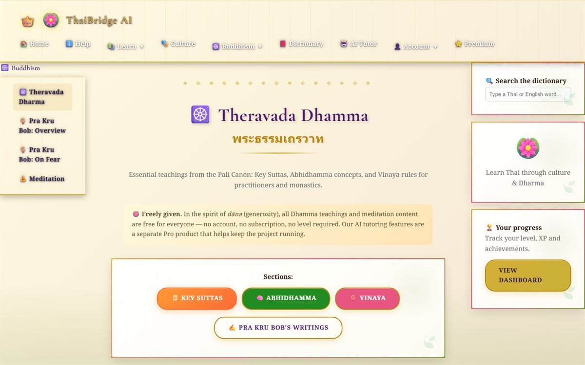
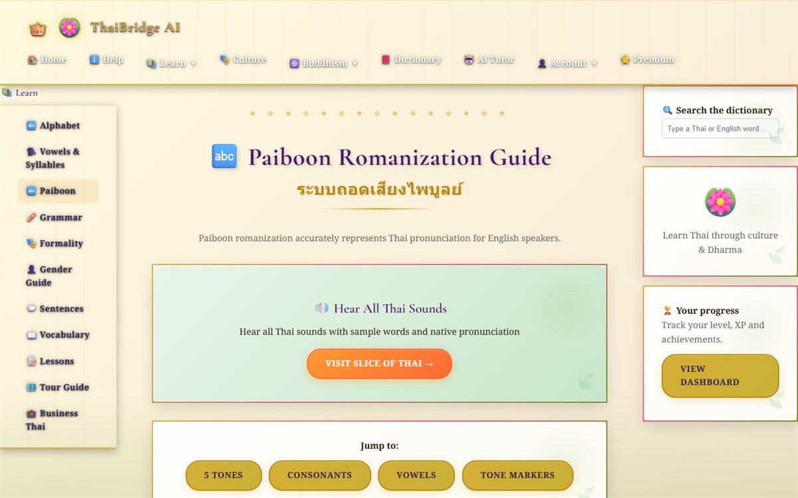
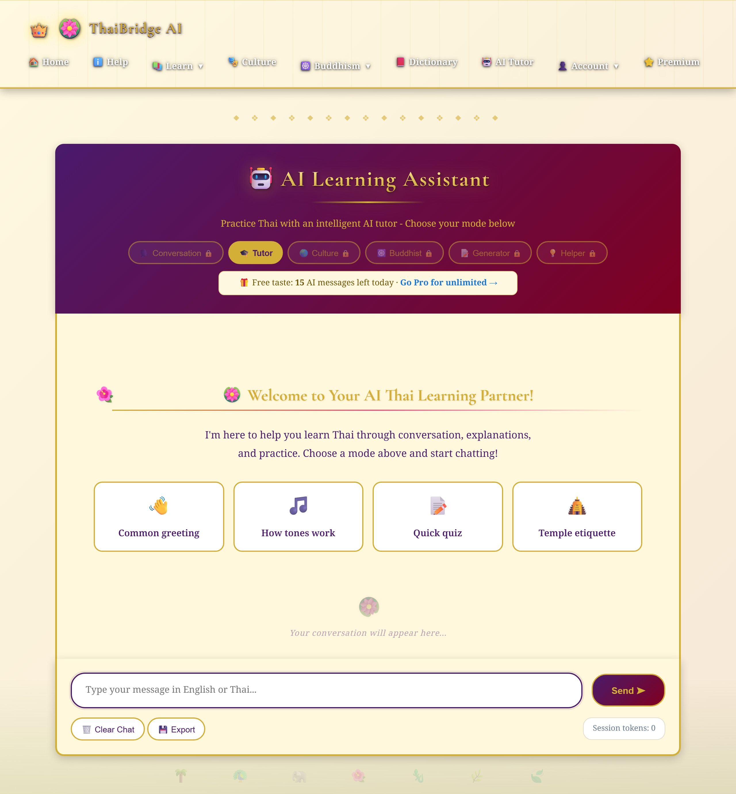

# 🪷 ThaiBridge AI

**Building a live, paid, AI-powered language app as my first web app — and proving every risky part actually works.**

[](https://thaibridge-ai.smoald.com)


🔗 **Live demo:** https://thaibridge-ai.smoald.com  ·  **Code:** https://github.com/joshuablakemorekay/thaibridge-ai

> *Heads-up for visitors: the demo runs on a free host that "sleeps" when idle, so the first page can take ~30 seconds to wake. The fastest thing to try is the [AI tutor](https://thaibridge-ai.smoald.com/chat) — no install or sign-up needed.*

<p align="center">
  
</p>

---

## At a glance

| | |
|---|---|
| **My role** | Sole developer — designed and built it (with AI as a pair-programmer) |
| **Type** | My first web app · a learning project, built in public |
| **Timeline** | Nov 2025 → Jun 2026 (planning → live) |
| **Stack** | Python, Flask, SQLite, Flask-Login, Claude API, Stripe, HTML/CSS/JS, pytest |
| **Status** | Live and public; core features verified end-to-end |
| **Headline proof** | Real test payment verified · 32 automated tests passing · live AI demo capped at a few pounds a month |

---

## The problem

I'm learning Thai, and the popular apps fail Thai learners in a specific way. **They don't teach Thai well, and none of them connect the language to its culture** — which, in Thai, is half the language. How polite you are literally changes the words you use, and a lot of everyday speech is rooted in Buddhism.

I also set myself a harder problem than "make a website." **As a beginner, I wanted to prove I could build the parts a real online product actually needs** — proper accounts, real payments, and a genuinely useful feature — not another to-do-list demo. The risk: those are exactly the parts that are easy to fake and hard to get right.

## My approach

I worked in public, kept an honest build journal, and made a few deliberate calls early that shaped everything after.

**1. I cut a huge plan down to something I could ship.** My first design was a big, expensive vision. Real progress only came when I shrank it to a minimum working version (an MVP — the smallest useful version), got *that* live, then layered on accounts, payments and the AI one at a time.

**2. I chose one source of truth for "who has paid."** Anything the browser can edit, a user can fake. So I decided that **the database — and only the database — owns subscription status**, and the database is written only by a signed, server-to-server message from Stripe (a webhook). A tampered cookie can't unlock paid features. This single decision removed a whole category of cheats and bugs.

**3. I refused to trust "it works."** This became the spine of the whole project. A green "deploy succeeded" or a "200 OK" only means a page *loaded* — not that it did the right thing. So I made a habit of checking the real evidence: the database, the logs, the actual screen. That habit paid off repeatedly (see Results).

**4. I made a values call on pricing.** I kept the Buddhist teachings and meditation timer **completely free** for everyone (no account, no paywall — *dāna*, freely given), and made the genuinely costly AI features the paid product. It gives the app an honest story rather than a stingy one.

## What I built

ThaiBridge AI is a server-rendered Flask app with:

- 🔤 **Thai alphabet and vocabulary lessons**, written so complete beginners can read straight away
- 🔊 **[Tones & Consonant Classes](https://thaibridge-ai.smoald.com/tones-classes)** *(new · Basic tier)* — a unified section that teaches the three consonant classes and the tone rules together (they're really one skill), with four progressive practice drills that plug into the same points-and-levels engine as everything else
- 🤖 **An AI tutor with six modes** — conversation, grammar, quiz generation, culture, Buddhism and gentle hints — powered by the Claude API, with a strict shared pronunciation rulebook injected into every prompt so the romanization stays consistent
- 📚 **Lessons, grammar, culture and temple-etiquette modules** (paid tiers), with the **Thai alphabet and the full Theravada Buddhism track free for everyone**
- 🔐 **Real user accounts** — proper sign-up, log-in and log-out, with passwords stored safely (hashed)
- 💳 **Freemium subscriptions** (Free · Buddhist Scholar £9.99 · Thai Master £19.99) through Stripe, plus an optional one-time **Instant Access Pass** (£9.99) that unlocks every section at once
- 🏆 **Gamification** — points, levels and achievements, with a learning path that unlocks as you go (paying opens a tier; you still level up to reach each section)
- 🧡 **Monk Mode** *(live)* — a free, code-unlocked lesson track written for Buddhist monks, with a switch between learning Thai and learning English, and its content kept in tidy per-topic files apart from the main app. It waives the paywall but keeps the levelling, so monks still learn their way up
- 🔊 **A pronunciation system built for each reader** *(live)* — the English side of Monk Mode carries native audio on all 140 items, a plain respelling with the stressed syllable in capitals, a tip written in Thai, and IPA behind a toggle for anyone who wants it. **New: a choice of British or American English** — flip the accent and the word (aeroplane/airplane), the respelling (MAW-ning/MOR-ning) and the voice all switch together, with 252 audio files per accent. The audio is generated once and committed as ordinary files, so the live site needs no speech service, no API key and no per-play cost
- 🗣️ **Teacher-sourced drills & Dhamma readings** *(live)* — real material from my Thai teacher became three lessons: L/R tongue twisters ("rice" vs "lice"), a second set for the V, F and TH sounds ("think" vs "sink", "faith" vs "fate"), and three Ajahn Sumedho readings with whole-passage audio in either accent — source credited, free-distribution honoured
- 🎯 **Built on the teacher's own method** *(new)* — after reviewing the lessons she made three points, and each became a feature. A word said perfectly alone slips back to the old habit inside a sentence, so every pronunciation lesson ends with a **From word to sentence** drill. Reading a short Dhamma text out loud exposes those slips and teaches you to pause at a comma and stop at a full stop, so lesson 12 gained a **reading guide** and pause-marked practice lines. And reading real texts shows a monk he has a *choice* of words — "stress" as well as "suffering", "uncertainty" or "transience" as well as "impermanence" — so there is now a **one idea, several words** section, each option with its own audio and a note on the shade of meaning it carries

## 📸 A look inside

| The learning side | The AI tutor |
|---|---|
|  |  |
| The Paiboon romanization guide, with the full learning menu down the side. | The AI tutor — pick a mode and chat. Free users see how many messages they have left today. **[Try it live →](https://thaibridge-ai.smoald.com/chat)** |

## 🚀 Run it locally

You'll need **Python 3.12** (the live site runs 3.12.8) and a free [Anthropic API key](https://console.anthropic.com) for the AI tutor.

1. **Get the code** (clone the repo — copy the project to your machine):
   ```bash
   git clone https://github.com/joshuablakemorekay/thaibridge-ai.git
   cd thaibridge-ai
   ```
2. **Install the dependencies** (the external tools the project relies on):
   ```bash
   pip install -r requirements.txt
   ```
3. **Set your two secret values** (Windows Command Prompt shown):
   ```cmd
   set ANTHROPIC_API_KEY=sk-ant-your-key-here
   set FLASK_SECRET_KEY=any-long-random-string
   ```
   > On Mac/Linux use `export ANTHROPIC_API_KEY="..."` instead. Generate a secret key with:
   > `python -c "import secrets; print(secrets.token_hex(32))"`
4. **Run the app:**
   ```bash
   python app.py
   ```
   Open **http://localhost:5000** — the database is created automatically the first time.
5. **Run the tests** (optional):
   ```bash
   python -m pytest tests/ -v
   ```

## Results & evidence

This is the part I care about most — not "I built it," but "here's the proof it works."

- **Payments work end-to-end, and I can prove it.** I took a real test-card payment through Stripe Checkout and confirmed the webhook flipped the user to a paid plan **in the database**, with a genuine Stripe customer and subscription ID attached — not just a "success" screen.
- **Checking the database caught a real bug.** The payment *looked* fine, but the renewal date was never being saved: Stripe had moved that value onto each subscription *item*, so my code was reading an empty field. **I'd never have caught it by trusting the success page** — only by inspecting the actual data. Found, fixed, re-tested.
- **32 automated tests pass.** The points-and-levels engine is covered by 32 unit tests — level thresholds, the 1× / 2× / 3× points multipliers per plan, level-up detection across boundaries, and progress-bar maths. *(Run `python -m pytest tests/ -v` → `32 passed`.)*
- **The build prompts are tested too.** An evaluation harness checks the ten prompts behind the app's features against written rubrics — **all ten pass at 100%.**
- **It's live, and the AI costs are walled off.** The public demo runs a cheap model, has a **hard monthly spend ceiling**, a **separate API key as a kill switch**, a per-visitor daily message cap, and an uptime pinger to keep it warm. A bad day can't run up my card.
- **It works on any screen.** I audited the layout across seven widths from a 320px phone upward and fixed a CSS specificity bug so every page collapses cleanly to one column — **zero sideways scroll**, desktop unchanged.
- **Scale & workflow:** ~6,100-line Flask app, a ~500-line AI module, 61 routes, ~39 pages, and a real ~5,000-entry English–Thai dictionary. The big recent work landed as a 44-commit feature branch merged cleanly into `main`, and I shipped my first proper pull request with a green automated check before merging.

## What I learned

- **"It works" needs proof.** The database, the logs and my own eyes are the real test — not a green tick. This one habit caught a payment bug, a wrong-Python-version deploy, and saved me from shipping broken billing.
- **Decide who owns each fact.** "Source of truth" sounds abstract until it quietly deletes a whole class of bugs and cheats for you.
- **Ship small, then grow.** A small thing that works beats a big thing that doesn't — every time.
- **Version control turns fear into freedom.** Because I could always roll back, I could take big swings (and let an AI take them) without panic.
- **Check what's already there before building.** The "click-to-open sections" I set out to add were already in the code — I just hadn't rolled them out.
- **Match the guide to the reader, not the language.** Monk Mode teaches two people from one set of lessons: a Western monk learning Thai, and a Thai monk learning English. I'd been showing both of them the same help. The Thai side was fine (Paiboon romanization does its job), but Paiboon has no symbols for *th*, *v* or *z* — so for English I built a separate system, with tips written in Thai. My first attempt was circular: I explained English using roman letters, to readers whose main reference for roman letters *is* English. Getting it wrong twice is what taught me the rule.
- **Listen to the question behind the question.** A friend who teaches Thai suggested a fix that was technically wrong (the L in *alms* really is silent) — but the design gap they were pointing at was real. Their one question became a whole feature: a British/American accent choice for the monk lessons.
- **When the code looks right, check what's actually running.** Building the audio, three bugs in a row wore the same disguise: a CSS rule silently overrode the "hidden" tag I'd just added; two audio files "failed" when really the *success message* had crashed and the error handler deleted the good file it had just written; and a `NameError` sent me through correct code because an old copy of the app was still running from earlier. The code was right every time and the thing in front of me was lying. **Trust what you can observe, and make sure you're observing the thing you think you are.**
- **Real teacher material beats content I'd invent.** My teacher's handout arrived with its own pedagogy — minimal pairs, twisters, readings in context. My job was to give it a home, not improve it. And honest infrastructure pays forward: the accent toggle built that morning made "read it in British or American" cost nothing.

## What's next

- **Have a native speaker review the Thai pronunciation tips** now live in Monk Mode — including the 25 rewritten this session for the accent work — plus the two Pāli terms spoken by an English voice, and the Thai glosses I drafted for the two new teacher-sourced lessons. Also: give the pronunciation guide page its own accent section (its British-only footnote is now out of date).
- **Polish the locked-section pages** to nudge people toward the right plan, and build a proper success page for the Instant Access Pass.
- **Finish the "click-to-open sections" redesign** across the remaining long pages.
- **Move to a database that survives restarts** (the free host wipes the current one on redeploy) and add proper database migrations.
- **Finish and verify a second payment option** (PayPal), the same careful, test-it-end-to-end way Stripe was done.
- **Switch Stripe to live keys** — the full test flow already works, so going live is the last step, not a rebuild.

---

*ThaiBridge AI is my first web app and an ongoing learning project. It's live, the core is verified, and I'm still building it in the open. The full build story — every win and mistake — is in [`JOURNAL.md`](./JOURNAL.md).*

<p align="center"><em>🙏 May your practice bring wisdom and peace.</em></p>
