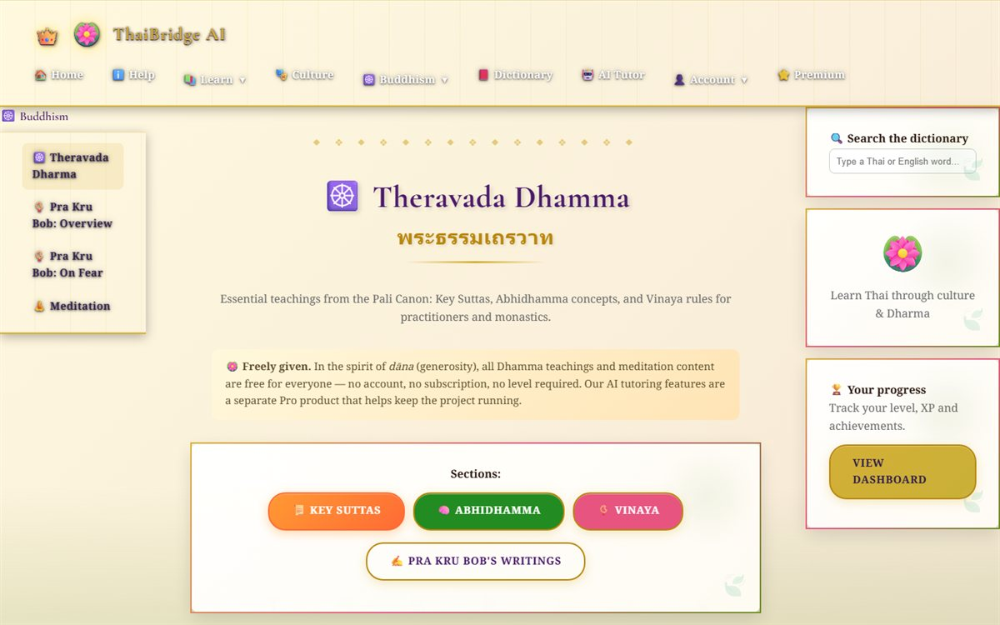
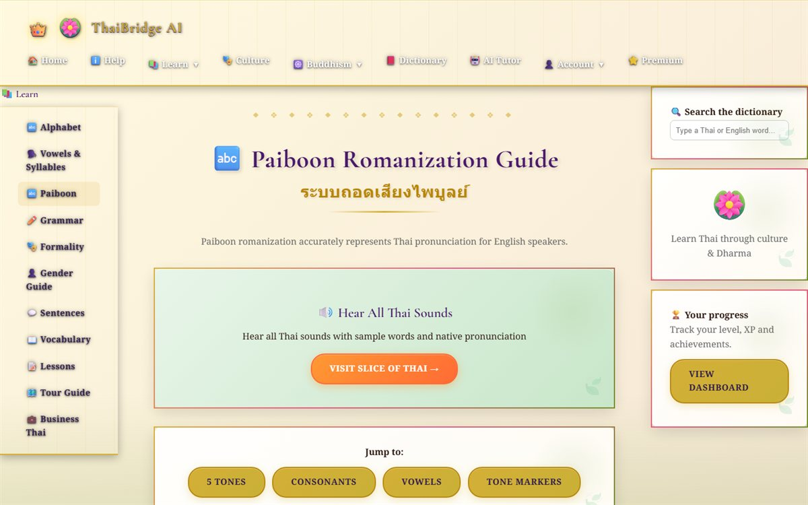
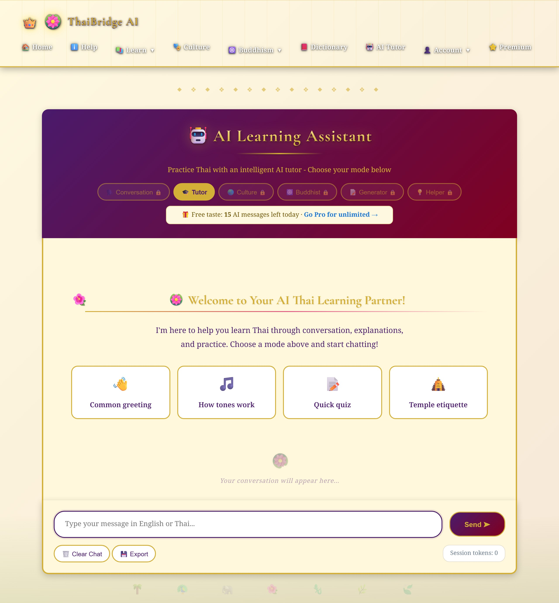

# 🪷 ThaiBridge AI

**Building a live, paid, AI-powered language app as my first web app — and proving every risky part actually works.**

[](https://thaibridge-ai.smoald.com)


🔗 **Live demo:** https://thaibridge-ai.smoald.com  ·  **Code:** https://github.com/joshuablakemorekay/thaibridge-ai

> *Heads-up for visitors: the demo runs on a free host that "sleeps" when idle, so the first page can take ~30 seconds to wake. The fastest thing to try is the [AI tutor](https://thaibridge-ai.smoald.com/chat) — no install or sign-up needed.*

<p align="center">
  
</p>

---

## At a glance

| | |
|---|---|
| **My role** | Sole developer — designed and built it (with AI as a pair-programmer) |
| **Type** | My first web app · a learning project, built in public |
| **Timeline** | Nov 2025 → Jun 2026 (planning → live) |
| **Stack** | Python, Flask, Postgres (Neon) with a SQLite fallback for local dev, Flask-Login, Claude API, Stripe, HTML/CSS/JS, pytest |
| **Status** | Live and public; core features verified end-to-end |
| **Headline proof** | Real test payment verified · 543 automated tests passing · accounts proven to survive a redeploy · live AI demo capped at a few pounds a month |

---

## The problem

I'm learning Thai, and the popular apps fail Thai learners in a specific way. **They don't teach Thai well, and none of them connect the language to its culture** — which, in Thai, is half the language. How polite you are literally changes the words you use, and a lot of everyday speech is rooted in Buddhism.

I also set myself a harder problem than "make a website." **As a beginner, I wanted to prove I could build the parts a real online product actually needs** — proper accounts, real payments, and a genuinely useful feature — not another to-do-list demo. The risk: those are exactly the parts that are easy to fake and hard to get right.

## My approach

I worked in public, kept an honest build journal, and made a few deliberate calls early that shaped everything after.

**1. I cut a huge plan down to something I could ship.** My first design was a big, expensive vision. Real progress only came when I shrank it to a minimum working version (an MVP — the smallest useful version), got *that* live, then layered on accounts, payments and the AI one at a time.

**2. I chose one source of truth for "who has paid."** Anything the browser can edit, a user can fake. So I decided that **the database — and only the database — owns subscription status**, and the database is written only by a signed, server-to-server message from Stripe (a webhook). A tampered cookie can't unlock paid features. This single decision removed a whole category of cheats and bugs.

**3. I refused to trust "it works."** This became the spine of the whole project. A green "deploy succeeded" or a "200 OK" only means a page *loaded* — not that it did the right thing. So I made a habit of checking the real evidence: the database, the logs, the actual screen. That habit paid off repeatedly (see Results).

**4. I made a values call on pricing — and then refined where the line sits.** The **Buddhist teachings are completely free** for everyone (no account, no paywall — *dāna*, freely given), and monastics get the entire app free through Monk Mode. I moved the line twice before it settled. Meditation started free, then went to the paid tier as it grew from a bare timer into guided sessions — I told myself the teaching was free and the *tooling* was the product. That didn't survive contact with the actual question: sitting in meditation isn't tooling, it's the practice the teachings exist for, and "the Dhamma is free but learning to practise it costs £9.99" is not a line I could defend. So meditation is free again, along with the Dhamma talks. **The Buddhism side is free; the Thai language course is the product.** Working out *where* a values line actually falls turned out to be harder — and more useful — than declaring one, and being willing to move it back was part of that. The same line moved once more when I noticed the AI's Dhamma mode was still Pro-only: a reader could reach the free teachings and then hit a paywall asking a question about them, which is the identical thing I'd already refused to do with meditation. It's free now. The daily message cap stays, because every message costs real money to run — **but that's the cost of the model, not a toll on the teaching**, and the difference matters.

**5. I worked *with* an AI agent, not from its answers.** Rather than asking a chatbot questions and pasting the replies in, I used Claude Code as an agent that explores the project, plans the task, edits the files, runs the tests and reports back — sometimes several agents at once, one investigating while another writes and a third reviews. My job is the other half: set the direction, make the calls that need judgement, review every diff, and approve what ships. That division only works if the review is real. The clearest proof is a change that stripped the indentation off 83 lines, imported cleanly and passed all 194 tests — because Python doesn't care about whitespace inside a dict literal. Nothing automated caught it. **Reading the diff did.**

## What I built

ThaiBridge AI is a server-rendered Flask app with:

- 🔤 **[Thai Alphabet](https://thaibridge-ai.smoald.com/alphabet)** *(free)* — all 44 consonants with a tap-to-hear chart, flashcards and a 44-question quiz, each letter recorded in Thai. **New: every letter now carries a picture of the word it's named after** — ก is "gɔɔ gài, chicken", so ก shows a chicken — on the chart, the flashcards and a new picture round in the quiz. The pictures are a **hand-drawn icon set: 44 SVGs in the site's own colours, 30 KB for the lot** (less than a single photograph), so they stay sharp at any size and there are no image licences to worry about. Passing it (35/44) unlocks the rest of the site
- 🔤 **Vocabulary lessons**, written so complete beginners can read straight away
- ✍️ **[Read & Write Thai Script](https://thaibridge-ai.smoald.com/read_write)** *(new · Basic tier)* — the bridge from knowing the letters to using them: a reading trainer that teaches how a Thai vowel can sit *before, above, below or around* its consonant (you always say the consonant first), a trace-over-the-guide canvas for forming all 42 written letters by hand, and a **story chooser with two levels of reading**: the Jataka Monkey King in graded Thai you read one tapped word at a time, and the **Matuposaka Jataka** in real, unsimplified Thai — thirteen paragraphs read whole, with the English hidden until you've read the Thai aloud
- 🔊 **[Tones & Consonant Classes](https://thaibridge-ai.smoald.com/tones-classes)** *(new · Basic tier)* — a unified section that teaches the three consonant classes and the tone rules together (they're really one skill), with four progressive practice drills that plug into the same points-and-levels engine as everything else
- 🔊 **Tap-to-hear audio across the whole app** *(new)* — a 🔊 button next to Thai words so you hear a native voice, now on **every page that teaches Thai**: all 13 learning-track pages (alphabet through business Thai) plus the Culture, Theravada and Meditation pages. Built as one shared player fed by a reusable wiring partial, so a new page is a one-line include. The audio is generated once and committed as ordinary files — no speech service, no API key, no per-play cost. **New: whole-paragraph readings.** Alongside the word-level clips, the Jataka passages are recorded straight through (165 seconds). Long clips stop when you tap them again; short ones still replay, since re-tapping a word you're drilling means "say it again"
- 🗣️ **Sentences built for speaking** *(new)* — a **practice mode** that hides the Thai so you produce it from the English prompt then tap to check, ten real-world conversations (including temple and alms-round dialogues), and an **everyday phrases** section for the little words that keep a conversation moving
- 🤖 **An AI tutor with six modes** — conversation, grammar, quiz generation, culture, Buddhism and gentle hints — powered by the Claude API, with a strict shared pronunciation rulebook injected into every prompt so the romanization stays consistent. **New: scenario roleplay** — pick a scene (order at a restaurant, haggle at the market, take a taxi) and the AI plays the other person and stays in character while you practise
- 🪷 **[Dhamma Talks](https://thaibridge-ai.smoald.com/theravada#dhamma-talks)** *(new · free)* — talks given by the monks behind the site, published in Thai and English one after the other, so you can read the Thai and check yourself against the English. Free to everyone, logged in or not: the Theravada track was already the site's one free section, on the principle that the Dhamma is freely given, so the talks sit inside it rather than behind a tier. Each talk is a single content file, so publishing the next one doesn't touch the code
- 📚 **Lessons, grammar, culture and temple-etiquette modules** (paid tiers), with the **Thai alphabet, and the whole Buddhism side — teachings, Dhamma talks, Pra Kru Bob's writings and meditation — free for everyone**
- 🔐 **Real user accounts** — proper sign-up, log-in and log-out, with passwords stored safely (hashed)
- 💳 **Freemium subscriptions** (Free · Buddhist Scholar £9.99 · Thai Master £19.99) through Stripe, plus an optional one-time **Instant Access Pass** (£9.99) that unlocks every section at once. **The plans now list what you actually get** — they'd fallen behind the app as pages were added, so Free names the Thai alphabet and its AI allowance, Basic names the reading, tones and conversation pages, and Pro names the roleplay partner and exercise generator. The free AI allowance is read straight from the setting the code enforces, so the advert can't drift from the limit again *(it had been promising 5 messages a day while allowing 15)*
- 🏆 **Gamification** — points, levels and achievements, with a learning path that unlocks as you go (paying opens a tier; you still level up to reach each section)
- 🧡 **Monk Mode** *(live)* — a free, code-unlocked lesson track written for Buddhist monks, with a switch between learning Thai and learning English, and its content kept in tidy per-topic files apart from the main app. It waives the paywall but keeps the levelling, so monks still learn their way up. **New: the whole site now says so.** Monk Mode always waived payment in the access code, but the pages kept quoting monks a price — an upgrade button on locked sections, a "£19.99/mo" tooltip in the footer of every page, and a full plans table on Progress and Premium. With Monk Mode on there is now **no price, no plan name and no way to pay anywhere on the site**; sections still open by level and alphabet, because that gate is about progress, not money. The one honest exception is the AI tutor, which stays capped for everyone — each AI reply costs real money to run
- 🔊 **A pronunciation system built for each reader** *(live)* — the English side of Monk Mode carries native audio on all 140 items, a plain respelling with the stressed syllable in capitals, a tip written in Thai, and IPA behind a toggle for anyone who wants it. **New: a choice of British or American English** — flip the accent and the word (aeroplane/airplane), the respelling (MAW-ning/MOR-ning) and the voice all switch together, with 252 audio files per accent. The audio is generated once and committed as ordinary files, so the live site needs no speech service, no API key and no per-play cost
- 🗣️ **Teacher-sourced drills & Dhamma readings** *(live)* — real material from my Thai teacher became three lessons: L/R tongue twisters ("rice" vs "lice"), a second set for the V, F and TH sounds ("think" vs "sink", "faith" vs "fate"), and three Ajahn Sumedho readings with whole-passage audio in either accent — source credited, free-distribution honoured
- 🎯 **Built on the teacher's own method** *(new)* — after reviewing the lessons she made three points, and each became a feature. A word said perfectly alone slips back to the old habit inside a sentence, so every pronunciation lesson ends with a **From word to sentence** drill. Reading a short Dhamma text out loud exposes those slips and teaches you to pause at a comma and stop at a full stop, so lesson 12 gained a **reading guide** and pause-marked practice lines. And reading real texts shows a monk he has a *choice* of words — "stress" as well as "suffering", "uncertainty" or "transience" as well as "impermanence" — so there is now a **one idea, several words** section, each option with its own audio and a note on the shade of meaning it carries
- 🐘 **One Jataka, two ways to read it** *(new)* — the **Matuposaka Jataka** (the elephant who wouldn't eat while his blind mother went hungry) appears twice on purpose: the full English telling on the Culture page, with the scripture framing that names who each character really is, and the **real Thai** on Read & Write — thirteen numbered paragraphs, royal register and all, each with the English hidden behind a button until you've read the Thai aloud — and **each paragraph is read aloud by a Thai voice**, so you can hear it done properly or check your own reading against it. Each version links to the other, so you can read it to understand it and read it to practise
- 📿 **[Digital Chanting Book](https://thaibridge-ai.smoald.com/chanting)** *(free)* — Thai Buddhist chants laid out line by line in **five layers**: the **Pali in Thai script** (what is actually chanted), the same **Pali romanised** for anyone who does not read Thai, the **Thai translation**, **Paiboon+** so a learner can read that Thai aloud, and the **English** meaning. Each layer has its own colour and its own on/off switch, so a Thai chanter hides the romanisation and English while an English reader hides the Thai script — **one page serving two different books**. It is built **digital-first on purpose**: the aim is a printed chanting book, and printing a thousand copies before anyone has read them is the expensive way to find out a translation reads badly. So every chant answers the same six questions in the same order — what it is, where it comes from, when it is chanted, why it was taught, what it means, and how to chant it — and lives as **structured data rather than page markup**, so the same source renders a web page today and a typeset page later. Chants break **one Pali line per verse**, the way the official book breaks them, with titled sections inside longer chants. Every chant also carries **the page number it appears on in the physical book** — shown on its card and again wherever the printed page turns — because a monk calls out a page and everyone chants from it, so a digital book that can't answer "page 47" has failed at the job. A page carries **more than its chants**, and the app now carries that too — the headings, the instructions telling a chanter what to do next, the closing that ends a whole service, the numbered notes on which word a layperson substitutes. That material belongs to the *page*, not to any chant, and until it had somewhere to live it was being read correctly and then silently dropped: two pages went live showing roughly **40%** of what the printed page shows, and no test failed. Pages 1–68 now reproduce the book block for block, in printed order — including the numbers the book prints beside a numbered list. That last part sounds trivial and wasn't: the app had its own count for every line, the book has its own, and **the two do not always agree**. The Dasadhamma Sutta opens with two chanted lines the book leaves unnumbered, so its item 1 is the app's verse 3. Forcing them to match would mean lying about one or the other, so a verse now carries both — the app's identity for the line, and what the page actually shows beside it, which is blank on most lines and must stay blank. The book's own **สารบัญ** is in too — all ten of its front-matter pages, **301 lines** naming every chant across the whole 325-page book. It is entered as *data* rather than reproduced as a picture of a list, which lets it do the one thing paper cannot: a line whose page is in the app carries buttons to that chant and that page, and a line whose page is not in yet stays plain grey text. So the contents doubles as an honest map of how much of the book has been entered — and completing page 1 turned three more lines into links with no further work. A link that went nowhere would be a worse lie than a visible gap. Front matter is numbered **(๓๖)** in its own bracketed sequence and the body has its own page 36, so the two never share a route: a monk calling out a number always means the body. Adding a chant is now a **three-stage workflow that reads photographs of the book off disk** — the whole book is photographed, one image per page. Stage 1 reads a batch of pages and writes what it found to a JSON file; Stage 2 reads that file and writes the chants in, counting every Thai character both ways to prove nothing was added or dropped; Stage 3 writes the commentary later, reading each chant straight out of the file. **Nothing crosses a clipboard** — Thai script, IAST diacritics and Paiboon+ vowels are exactly the characters copy-paste damages quietly. The two stages stay apart on purpose: one pass that reads a photograph and writes the chant in the same breath would be marking its own homework, so Stage 1 may not touch the app and Stage 2 may not open the photographs. Because the book runs to **286 chants**, the batch stage carries a safeguard worth naming: it lists every chant it was given *before* writing any of them, so a reply cut off halfway can be spotted — truncated data still looks like valid data, and nothing written at the end of a reply can report that the end went missing. **Ninety-seven chants and 1,363 verses in so far**, all transcribed from a physical Thai chanting book — including the four requisite reflections (36 verses), the five subjects for frequent recollection, two anumodanā addressed to the devas, and a pattidāna dedicating merit to all beings. Some chants are printed **Pali-only** with no Thai translation beside them; those say so on the page, so nobody mistakes a working English translation for the book's own words. The romanised Pali and Paiboon are **unreviewed drafts**, and 638 flagged items are still to be checked line by line against the printed copy — each one naming the photograph it came from, so the page can be found again. Both stages of that workflow are now tested scripts rather than instructions followed by hand: **`apply_batch.py` writes the chants in, `check_batch.py` checks the reading before it gets there, `check_pages.py` asks whether the data on page 47 is what page 47's photograph recorded, and `check_render.py` asks whether the page a reader actually opens shows it.** 17 checks over 543 tests. That fourth one is the newest and the only one that renders: correct data can still render badly, and a block dropped by a template is invisible to the other three. It **walks** the page in printed order rather than counting how often each line appears, because counting is wrong twice over — the book legitimately prints some lines twice, and a short verse sits inside a longer one. Every false alarm the hand-written versions produced came from counting. The second one exists because the first-draft checks were re-improvised from the prompt each session, and three of them returned false results in a single afternoon — a mangled marker reporting "0 checks written" when all twelve were present, a duplicate citation that was really a CSS rule, and an ordering error caused by matching text the book legitimately repeats. **A check that cries wolf is worse than no check**, because the next real failure gets waved through. It earned its keep immediately: it found that one shipped batch file cannot be re-applied by the tool meant to read it
- 📖 **[Read the chanting book page by page](https://thaibridge-ai.smoald.com/chanting/pages)** *(new · free)* — the reason the page numbers were captured in the first place. A monk calls out a page number and the whole room turns to it, so **`/chanting/page/47` shows what page 47 of the printed book shows** — which is usually the tail of one chant and the start of the next, not a whole chant. It reads **two ways from one source**: *as the book prints it*, showing only the layers the book actually carries and flowing a run-on passage back into a justified block, or *verse by verse* with all five layers numbered. Next and previous **skip pages not yet entered and say so**, because a silent jump would teach a reader the book runs 47, 48, 53; and a page that isn't in yet **isn't a 404** — the reader typed the number they were given, so it offers the nearest pages either side. Where the book prints Pali only, the page says on **every page the chant appears on** that the English is a working translation and not the book's. **Pages 1–68 are live**, plus 217–221 — the whole morning service, the Uposatha observance, all seventy-five Sekhiya training rules, the Suat Jaeng with its seven Abhidhamma books, the blessing chants, the whole evening service, the sāmaṇera's training rules and grounds of expulsion, and the festival-day observances with their offerings of flowers, incense and candles.
- ♿ **[Learning Support](https://thaibridge-ai.smoald.com/) accessibility panel** *(new)* — a menu on every page that lets a learner switch on an easy-to-read font (Atkinson Hyperlegible), bigger text, extra letter/line spacing, or **read-aloud** (the browser's own voice, English only) where they choose what gets read: the whole page, a part they click on, or text they've highlighted. It says plainly who it's for — dyslexia, ADHD, autism, low vision or visual stress, and anyone who finds long English text tiring — and each learner mixes only what helps them. Entirely front-end: choices are saved in their own browser and nothing touches accounts or payments

## 📸 A look inside

| The learning side | The AI tutor |
|---|---|
|  |  |
| The Paiboon romanization guide, with the full learning menu down the side. | The AI tutor — pick a mode and chat. Free users see how many messages they have left today. **[Try it live →](https://thaibridge-ai.smoald.com/chat)** |

## 🚀 Run it locally

You'll need **Python 3.12** (the live site runs 3.12.8) and a free [Anthropic API key](https://console.anthropic.com) for the AI tutor.

1. **Get the code** (clone the repo — copy the project to your machine):
   ```bash
   git clone https://github.com/joshuablakemorekay/thaibridge-ai.git
   cd thaibridge-ai
   ```
2. **Install the dependencies** (the external tools the project relies on):
   ```bash
   pip install -r requirements.txt
   ```
3. **Set your two secret values** (Windows Command Prompt shown):
   ```cmd
   set ANTHROPIC_API_KEY=sk-ant-your-key-here
   set FLASK_SECRET_KEY=any-long-random-string
   ```
   > On Mac/Linux use `export ANTHROPIC_API_KEY="..."` instead. Generate a secret key with:
   > `python -c "import secrets; print(secrets.token_hex(32))"`
4. **Run the app:**
   ```bash
   python app.py
   ```
   Open **http://localhost:5000** — the database is created automatically the first time.
5. **Run the tests** (optional):
   ```bash
   python -m pytest tests/ -v
   ```

## Results & evidence

This is the part I care about most — not "I built it," but "here's the proof it works."

- **Payments work end-to-end, and I can prove it.** I took a real test-card payment through Stripe Checkout and confirmed the webhook flipped the user to a paid plan **in the database**, with a genuine Stripe customer and subscription ID attached — not just a "success" screen.
- **Checking the database caught a real bug.** The payment *looked* fine, but the renewal date was never being saved: Stripe had moved that value onto each subscription *item*, so my code was reading an empty field. **I'd never have caught it by trusting the success page** — only by inspecting the actual data. Found, fixed, re-tested.
- **The live database was deleting itself, and I can show it isn't any more.** Every account created on the live site was being wiped on the next deploy — the database was a SQLite file on a disk the host replaces each time. Nothing errored and no test failed; the rows were simply gone. The fix was Postgres (Neon, in the same region as the app), and the proof is the only one that counts: **I registered an account, forced a redeploy, and logged back in.** Before that change, those same three steps destroyed the account.
- **543 automated tests pass.** The points-and-levels engine is covered by 32 unit tests — level thresholds, the 1× / 2× / 3× points multipliers per plan, level-up detection across boundaries, and progress-bar maths. A further 12 cover the parts that touch accounts: that progress survives losing the cookie, that a saved blob can never grant itself a paid tier, and that rate limits identify the visitor rather than the proxy in front of them. *(Run `python -m pytest tests/ -v`.)*
- **I broke the new tests on purpose to see whether they'd notice.** Writing a test proves nothing until you've watched it fail. I disabled the progress-loading and the field filtering one at a time, confirmed the matching test went red each time, then restored the code. **A test I've only ever seen pass is a test I haven't run.**
- **The build prompts are tested too.** An evaluation harness checks the twelve prompts behind the app's features against written rubrics — **all twelve pass at 100%.**
- **A green tick is a claim, not evidence.** Those rubrics all passed — until I fed them deliberately broken input to see whether they'd actually catch it. One check had never worked: it looked for the wrong spellings only when they carried no tone mark, and in this romanization *every* syllable carries one, so it had been quietly passing everything for months. **A test you've only ever seen succeed hasn't been tested.**
- **It's live, and the AI costs are walled off.** The public demo runs a cheap model, has a **hard monthly spend ceiling**, a **separate API key as a kill switch**, a per-visitor daily message cap, and an uptime pinger to keep it warm. A bad day can't run up my card.
- **It works on any screen.** I audited the layout across seven widths from a 320px phone upward and fixed a CSS specificity bug so every page collapses cleanly to one column — **zero sideways scroll**, desktop unchanged.
- **An audit found a page I'd never actually locked.** Sweeping the paywall for Monk Mode, I rendered all 28 pages twice — once with Monk Mode on, once off — and checked the HTML rather than clicking around. That turned up something bigger than the display bug I was chasing: **the Vocabulary page had a complete set of access rules written down and not one line of them enforced**, because the route was missing its one-line guard. It had been readable by anyone on the free plan. The same pass proved the paid experience came through untouched, page by page.
- **The chanting book is generated, not typed — and I can show nothing was lost.** Seven chants went in during one session, and none of the Pali or Thai was hand-typed into the code: each chant was transcribed once, then the Python was *generated* from that file, with every Pali, Thai and Paiboon line written as a single unwrapped line so the text-wrapping code physically cannot reach it. Every chant was then checked character by character against its source — **10,846 characters in, 10,846 out; delta 0, every time.** For a book meant to be printed, that matters more than any feature: a dropped space is invisible on screen and wrong forever on paper.
- **A check that refuses to run is worth more than one that passes.** Stage 2 reconciles a batch against its own page map before writing a line, and on the very first real batch it **stopped and wrote nothing** — the map claimed a chant had 12 verses where the entry had 9. Re-reading the photograph confirmed nine, so the *map* was corrected to match the page rather than the entry, and the batch file records that it was. The design is that the map exists to disagree.
- **The same step, written by hand three times, silently half-succeeded once.** A script reported *"CONTINUES marker removed"* and hadn't removed it — leaving a finished chant marked as unfinished, which is exactly what gets searched for to find outstanding work. That became `scripts/apply_batch.py` with **24 tests**, most of them about the script *refusing* things. Dry-running it against the batches already applied then found a gap in the new script itself: no duplicate-id guard, so re-applying the first batch would have appended eight duplicate chants.
- **Checking that the new thing is present is not checking that the old thing is gone.** A rebuilt reference PDF still told the reader to open a chat and paste — the prompts inside it were correct, but the sheet's own instructions were hardcoded in the PDF builder. It survived verification because I'd only ever asserted that the new rules *were* in the file. The guard now asserts **absence**.
- **Corrections keep their own evidence.** Where I authorised fixing an error in the Thai, the fix carries a note holding the *original* reading. Correcting silently would have destroyed the one thing I need in order to check it against the physical book — so the file now records 39 corrections and 88 outstanding questions, each anchored to its verse.
- **A verse and a colophon look identical and are not the same thing.** Eight chants held their printed จบ line — *"here end the verses on…"* — as a **numbered verse**, so the app invited a reader to chant the sentence that says the chanting has finished. The book sets it centred, as a colophon, and the app has a field for exactly that. Fixing it needed the photographs rather than the data: Pabbatopama's verses run to the very foot of page 30, so **its colophon is printed on 31**, and only the page could say so. The tooling had actually spotted five of these and *skipped* writing the closing to avoid printing it twice — the right call at the time, and a note in a report that nobody had acted on.
- **My own migration script deleted five chanted lines, and nothing failed.** The script that moved those colophons matched verse dicts **by position**, assuming `'number'` was the first key. On 27 hand-written dicts `'section'` comes first, so it matched the *wrong* verse and removed a real line — leaving the numbering reading **21, 22, 24**. It imported cleanly and the suite stayed green; I caught it by printing the verse numbers before rendering anything. The rewrite anchors on the verse's own text, which cannot be ambiguous, and the root cause is now pinned: **one key order for every verse dict in the file, with a test I negative-tested by reverting a single dict to prove it fails.**
- **A new checker's first red result is more likely to be the checker.** I finally wrote down the one check I'd been re-improvising every page — does the page a *reader* opens show what the book prints, in printed order? It failed 18 pages, then 9 verses, then 5 verses. **Every one was the checker being wrong and the app being right.** Blocks render above the chant they introduce, not below; couplet breaks are `\n` in the data and markup on the page; and a line the page break cuts in half renders where it *starts*, not where it finishes. Had I trusted the first red result I'd have "fixed" five pages that were already correct. It also settled what the check should *not* do: it doesn't police which chant renders first or where a block sits, because two other functions already decide those and have their own tests — **a second copy of a rule inside a checker is how a checker starts disagreeing with the thing it checks.**
- **A marker nothing validates is a promise nobody kept.** Where a page break cuts a line mid-sentence the reading is stored with `[…]` and the next page completes it. I wrote one of those by hand and then realised nothing checked it: not that both chanted layers agreed on where the break fell, not that the chant was actually listed as continuing, not that the cut fell on the last line. I proved all three passed silently before writing the check, rather than assuming they would.
- **A report that describes the wrong thing is a bug even when the data is right.** Two faults in the batch tool misreported rather than miswrote: a comment recorded `COMPLETED FROM p?` because it read a key that deliberately does not exist, and a marker count was taken around one removal, so a batch that finished one chant and opened another announced `1 -> 0` of a file still holding one. The data was correct every time, which is why both survived so long — **the report is what a human trusts, so it has to describe the file and not the step.**
- **Scale & workflow:** ~6,100-line Flask app, a ~500-line AI module, 61 routes, ~39 pages, and a real ~5,000-entry English–Thai dictionary. The big recent work landed as a 44-commit feature branch merged cleanly into `main`, and I shipped my first proper pull request with a green automated check before merging.

## What I learned

- **Data can answer questions a picture cannot.** The book's contents could have been reproduced as an image of a list and looked identical. Entered as data instead, it became a progress map that updates itself: finishing page 1 turned three more index lines into working links without anyone touching the index. **The cheapest feature in the app was a side effect of storing the right thing.**
- **Store what is printed; derive the rest.** The index carries a page number in Thai numerals. The first draft stored both that and the plain number, by hand, three hundred times — two values that must agree and nothing making them. Now only the printed numeral is stored and the other is worked out from it, so they cannot drift.
- **A test can only fail at what it was told to check.** Two pages went live showing about 40% of what the printed page shows, and the suite stayed green the whole time — because every test asked "is the chant text right?" and none asked "is the page complete?". The reading stage had captured the missing material perfectly and the writing stage had nowhere to put it, so it went quietly. I found it by holding the book next to the app. **The dangerous gap isn't a failing check; it's a question nobody wrote a check for.** The workflow now refuses to close a batch while anything it read is unaccounted for — "there is no field for it" stops the run instead of dropping the content.
- **Ask for proof that nothing was lost, not just that something was added.** When I asked for the workflow to be improved, I said it had to still do everything it did before. That turned out to be the useful instruction: the answer came back as *229 lines added, 0 removed, all 45 original sections still present* — checkable, rather than "yes, it's all still there".
- **"It works" needs proof.** The database, the logs and my own eyes are the real test — not a green tick. This one habit caught a payment bug, a wrong-Python-version deploy, and saved me from shipping broken billing.
- **A status page is a claim about the system, not the system.** In a single session: a settings file that reported saved and hadn't been, an environment variable saved in the hosting dashboard that wasn't in the dashboard, and a live site serving two-hour-old code while reporting itself healthy and "Live". None of them announced anything. Each was settled the same way — by checking the thing itself rather than the thing that describes it. **The most expensive failures are the ones that look exactly like success.**
- **A red result can be my own mistake.** A check I'd written reported the same failure thirteen times running, and the fault was in the check: it was sending the wrong field name, so the server was rejecting *me*, not failing. I nearly reported a working feature as broken twice more for the same reason — once from a script that only kept the first of two login cookies, once from a check that matched text it was never meant to look at. **Before believing a failure, confirm the test can pass at all.**
- **Decide who owns each fact.** "Source of truth" sounds abstract until it quietly deletes a whole class of bugs and cheats for you.
- **A correction that hides the evidence is worse than the error.** Fixing a wrong character in the Thai is easy; the hard part is that fixing it silently removes the very thing I need to check it against the printed book. Every correction now sits next to the original reading it replaced.
- **Only correct what the text itself proves.** Changing `เล่า` to `เหล่า` is fair when the same chant spells it correctly five times over. Changing `เกิด` to `เถิด` only *reads* better — so that one stays flagged as a question, not silently "improved". Plausible is not the same as proven.
- **A denylist only catches what you've already seen.** A stray key kept turning up in my source data under a new name each time — `note`, then `stanza_note`, then `line_break_note`. Listing the bad names kept failing; listing the *good* ones caught it every time. **Describe what you want, not what you're trying to avoid.**
- **Ship small, then grow.** A small thing that works beats a big thing that doesn't — every time.
- **Version control turns fear into freedom.** Because I could always roll back, I could take big swings (and let an AI take them) without panic.
- **Check what's already there before building.** The "click-to-open sections" I set out to add were already in the code — I just hadn't rolled them out.
- **Match the guide to the reader, not the language.** Monk Mode teaches two people from one set of lessons: a Western monk learning Thai, and a Thai monk learning English. I'd been showing both of them the same help. The Thai side was fine (Paiboon romanization does its job), but Paiboon has no symbols for *th*, *v* or *z* — so for English I built a separate system, with tips written in Thai. My first attempt was circular: I explained English using roman letters, to readers whose main reference for roman letters *is* English. Getting it wrong twice is what taught me the rule.
- **Listen to the question behind the question.** A friend who teaches Thai suggested a fix that was technically wrong (the L in *alms* really is silent) — but the design gap they were pointing at was real. Their one question became a whole feature: a British/American accent choice for the monk lessons.
- **When the code looks right, check what's actually running.** Building the audio, three bugs in a row wore the same disguise: a CSS rule silently overrode the "hidden" tag I'd just added; two audio files "failed" when really the *success message* had crashed and the error handler deleted the good file it had just written; and a `NameError` sent me through correct code because an old copy of the app was still running from earlier. The code was right every time and the thing in front of me was lying. **Trust what you can observe, and make sure you're observing the thing you think you are.**
- **Real teacher material beats content I'd invent.** My teacher's handout arrived with its own pedagogy — minimal pairs, twisters, readings in context. My job was to give it a home, not improve it. And honest infrastructure pays forward: the accent toggle built that morning made "read it in British or American" cost nothing.
- **Expert feedback can change a structure, not just its contents.** My Thai teacher's sharpest note was that a word pronounced perfectly on its own gets mispronounced again the moment it sits inside a sentence — old habits return. That isn't a request for more words; it's a request for a different *shape* of lesson. So every pronunciation lesson now ends with a "From word to sentence" section that tests the sound in real sentences. **The most valuable feedback often describes a gap in the design, not a gap in the content.**
- **A fix isn't finished until it's applied everywhere the problem exists.** She named V, F and TH as the sounds Thai speakers get wrong, so I built a lesson for them and called it done. Then I checked the ten older lessons: 15 entries carried those sounds with no mention of them — in words as ordinary as *food*, *faith*, *mindfulness* and every *venerable*. **The lesson named after the problem was the easy half.**
- **When a job repeats, stop and build the tool.** Rolling audio onto sixteen pages started as hand-editing each one. On the big grammar page (~190 phrases) that broke down, so I switched to a small script that tags every Thai word automatically — then pulled it into a reusable partial. The last few pages were a one-line include each. **The refactor mid-job paid for itself before the job was even done** — and the same check-what-users-actually-see habit caught a live page rendering raw code (`{'thai': ...}`) that the data alone never revealed.
- **Cut the feature that doesn't earn its place — and give control back to the reader.** My accessibility panel had a "reduce motion" toggle that barely changed anything, so it went: clutter in a menu whose whole job is removing clutter. Read aloud had the opposite problem — it read the *whole* page, useless to someone who wanted one paragraph. Now the learner chooses: whole page, a part they click, or text they've highlighted. **And a browser detail worth knowing: clicking a button wipes whatever the user had highlighted, so the code has to remember the last highlight as it happens.**
- **The right technique in one place is the wrong one in another.** I set the new alphabet pictures to "lazy load" — the standard trick for images far down a long page. But here exactly one picture is built at the moment it's shown, so lazy loading could only ever delay the thing being looked at; in a background tab it never appeared at all. The same feature has the mirror case: the 44-tile chart uses emoji because 44 downloads at once is reckless, while the flashcard shows a real photograph because one download is nothing. **A technique isn't good or bad on its own, only in a situation.**
- **When a rule expires, replace it with a narrower one — not with nothing.** My alphabet chart shows emoji rather than pictures because 44 images at once was the page weight that once crashed its renderer. But two letters were stuck showing a drum and a trophy: Unicode has no cymbals character and no offering-tray character, so no emoji swap could ever fix them. My first move was to put my drawings on all 44 tiles, reasoning that vectors weigh nothing so the old rule no longer applied. That was too broad, and I was pulled up on it: emoji are *designed* to be legible at that size and a shrunk drawing isn't, so only those two letters actually needed one. **The exception now lives in the data as a flag, not as two letter names buried in the code** — so the next one is a one-line change. The rule's reason had only half-expired, and I'd thrown out the half that still held.
- **When you can't source it, make it — the constraint often picks the better answer.** I wanted photographs for the 44 letters but couldn't use them: each needs a licence that survives in a public repo, and 44 downloads is weight this page can't carry. So I drew them as vectors instead — 30 KB for all 44, sharp at any size, nothing to license. And judging your own work is part of the work: laid out side by side, four of my icons were plainly bad (the plate read as a target, the horse as a blob) and got redrawn. **I only saw that because I looked at them together, at the size they'd actually be used.**
- **A quiz question has to be answerable.** Twelve of the 44 meanings have no honest emoji — a cattle goad, a pot lid, a character from the Ramakien. Rather than fudge them I marked them, and the quiz's picture round skips them: naming a letter from a picture that only sort-of fits isn't a test, it's a trick.
- **The worst bugs raise no error.** A story on my Culture page linked to a page that doesn't exist. Everything looked healthy — the page returned 200, the link rendered, nothing appeared in any log — because the page was *guessing* the link by turning each story's ID into a URL. That worked for four stories whose IDs happen to double as vocabulary categories, and silently failed for the fifth, which has no vocabulary. **Anything derived by convention rather than declared can drift apart without a single thing looking broken.** So the stories now state their own destination, and a check at startup refuses to boot the app if one points nowhere — I fed it deliberately broken data to prove it bites.
- **A new requirement doesn't entitle you to change behaviour for everyone.** Adding 19-second paragraph recordings exposed that my audio player had no stop — tapping a playing button just restarted it. Fine for a one-second word, useless for a paragraph. The quick fix was to make every button stop on a second tap, which would have quietly broken every existing 🔊 button on the site, because re-tapping a word you're drilling means *"say it again"*. **So stopping is opt-in: the long clips ask for it, and several hundred existing buttons are untouched.** The related habit: a speech request that dies halfway still writes a valid, playable MP3 — just a short one — so I check long recordings by seconds-per-character, where a truncated clip stands out, not by whether the file exists.
- **When the text is too hard, don't simplify the text — change the interaction.** I needed a Buddhist Jataka tale readable in Thai script, so I graded it down: three-to-six words a sentence, tapped one word at a time. That was the wrong instinct. The answer was to keep the Thai exactly as hard as real Thai is — royal register, long sentences — and change what the page *asks you to do* with it: read a whole paragraph aloud, then press a button to check yourself against the English. So the reader now supports two formats, tapped-word for a beginner and read-whole for real Thai, and a learner meets the same story at whatever stage they're at. **Same words, different job for the reader.** The related lesson came from being told no three times in one session: my first move was a brand-new "Stories" section, when the content already had homes and needed linking, not relocating.
- **An undefined CSS variable takes the whole line with it.** Four buttons had invisible labels: they used `var(--gold)`, which is defined nowhere (the real name is `--royal-gold`), so the background was thrown away and white text sat on a pale page. They appeared on hover, because *that* rule used a variable that exists. **The same two dead names are used ~90 times across 16 templates** — colours that have never rendered as written. **And a decision lives in more places than the code enforcing it:** putting meditation back on the free side was one word in a table, but three other places had argued the old position — a banner, the pricing page, and this README.
- **Ask where something belongs before asking how to build it.** My first question wasn't which template to write — it was which page already does this job. Answering that settled the design *and* the pricing in one go: the Theravada page is free because the Dhamma is freely given, and that reason was already sitting in a comment above the free/paid table. **The second pull was towards the wrong pattern** — the nearest example was two hand-built articles on that very page, a route and a 500-line template each. Fine for two, painful for a series. The model I actually wanted was in a different folder: Monk Mode's folder-of-JSON. **The closest example is not always the right one.**
- **Writing a rule down isn't the same as enforcing it.** My free/paid table had a full entry for the Vocabulary page — level, plan, prerequisite — and it did nothing at all, because the route never asked. The table *looked* authoritative, which is exactly why nobody checked it. **A setting that isn't read by anything is a comment, not a rule.** The related trap in the same job: my search said the AI chat page was clean of price talk for monks. It wasn't — those prompts live in JavaScript strings, which my search never looked at. **A search answers what you asked, not what's true**, and I nearly reported it as done.
- **A flag is only as good as every place that reads it.** "Monk Mode is free" was correct in the one function that grants access, and ignored by five templates that carried on quoting prices. The behaviour was right and the app still told monks to pay. **Getting the logic right is half the job; the other half is every place that talks about it.**
- **A prompt that contradicts itself does not fail — it splits the difference.** My Paiboon generator said `ง → ng` on one line and showed `waŋ not wang` as its own example on the next. Given a rule that disagrees with its example, the AI picked one at random each time — so instead of being consistently wrong, the dictionary came out a **roughly 65/35 mix across 904 entries**. That is far harder to spot than a clean failure, because it reads as flakiness rather than a bug with a cause. **The fix that mattered was not cleaning the 904 cells, it was fixing the prompt** — otherwise the next batch would have quietly put them back. For a project aiming at print this is not cosmetic: on a website an inconsistency is patched next week, but in a book it is permanent, and a pronunciation guide that spells one sound two ways stops teaching.
- **When a spec contradicts its own examples, trust the examples.** Building the chanting book meant romanizing Thai, so I opened my AI's pronunciation rulebook — and found three of its five tone marks defined wrongly: `à` labelled falling, `â` rising, `ǎ` low. The examples printed *directly underneath* those rules had used them the standard way all along — `sà-wàt-dii`, `kâ`, `rʉ̌ʉ` — so the file had been arguing with itself, and every AI reply on the site was working from a rulebook that disagreed with its own worked answers. **The examples came from real Thai; the rules came from memory.** The neighbouring lesson landed the same day: **Pali is not Thai.** Both sit in Thai script on the same page, and I nearly ran my Thai romanization system over the Pali — same letters, different language, different rules entirely. **A romanization system belongs to a language, not to a script.**
- **Design for the reader you didn't picture.** Accessibility isn't one switch — different people need different help, so I built separate toggles, not a single on/off. And a blunt reminder that "done" needs *looking*: my panel text was black on a dark menu and invisible until I actually viewed it. **Check colours against their real background, not in your head.**
- **Credit is worth more when it's specific.** I had "By Pra Kru Bob" on two donated essays and a one-line translation credit on a Dhamma talk — both true, both thin. What made me look again was wondering how I'd credit the 44-volume Pali Canon if I add it: if I couldn't do it well for two monks I know, I had no business attempting it for a canon. The pages now name **Pra Kru Samu Panya Vajiro** in full with the attainments that bear on the work, and give Dr. Sujan's doctorate. **The detail that turned out to matter most for learners wasn't the credit itself** — it was saying that his Thai is *not* word-for-word. The page stacks Thai and English as pairs, so anyone comparing them would have assumed they'd misread the Thai, when the two genuinely differ.

## What's next

- **Get the Thai — and now the audio — reviewed by my teacher.** A generated review sheet (`docs/review-2026-07-20-monk-english.md`, 152 items across 10 lessons) is ready to send, covering every AI-drafted pronunciation tip, sentence translation and word-choice note. The script that builds it diffs against an earlier commit (compares versions to see what changed), so future rounds only ask about material she hasn't already corrected. Now newly in scope for her ear: the draft Thai in the new Read & Write section (including the Jataka retelling), the Phase-2 conversations and everyday phrases (especially the temple/alms-round Thai), and **all the tap-to-hear audio** — every clip is a machine (edge-tts) voice, so a native pass would let me drop the "unverified" caveat. Still outstanding too: the two Pāli terms spoken by an English voice, and giving the pronunciation guide page its own accent section (its British-only footnote is out of date).
- **Enter the remaining 257 pages, then check the flagged items against the physical book.** The workflow is settled and all three of its stages are now tested scripts — 97 chants are in and pages 1–68 read straight through. What's left is the part only I can do: `chanting.py` carries **638 open questions and 40 recorded corrections**, each anchored to its verse and naming the photograph it came from, covering everything from a doubled word to whether a Thai block has been split into the right verses. Until those are worked through, the romanised Pali and Paiboon stay marked as unreviewed drafts. Some need a decision rather than a check — whether my book really prints ติลักขะณาทิคาถา twice, and whether ก็ and ย่อม should be short or long in Paiboon across every chant at once. And one wants a photograph rather than an answer: a single glyph on pages 17–18 sits somewhere between ฬ and พ, and it decides the spelling of **five chanted words**. Every reading of it is recorded as a judgement with its reasoning, not quietly fixed, so one clearer photograph settles all five at once.
- **Get the hand-drawn letter icons checked by a Thai eye.** Eight are culturally specific — the ชฎา headdress, Montho, a เณร novice, a ยักษ์ giant, a ฤๅษี hermit, a ศาลา pavilion, the จุฬา kite and a พาน offering tray — and I drew them from description rather than from knowing them. Any that miss get redrawn, or simply deleted: with no file present that letter falls back to its emoji, no code change.
- **Add a high-contrast mode and screen-reader polish** to the Learning Support panel — the parts that would fully deliver on its "low vision" promise.
- **Polish the locked-section pages** to nudge people toward the right plan, and build a proper success page for the Instant Access Pass. *(The Monk Mode side of these pages is done — they no longer offer monks an upgrade they don't owe.)*
- **Decide whether the AI tutor should be free for monks too.** It's the last thing Monk Mode doesn't cover, and the only one with a real bill attached, so it's a cost decision rather than a code one.
- **Finish the "click-to-open sections" redesign** across the remaining long pages.
- **Move to a database that survives restarts** (the free host wipes the current one on redeploy) and add proper database migrations.
- **Finish and verify a second payment option** (PayPal), the same careful, test-it-end-to-end way Stripe was done.
- **Switch Stripe to live keys** — the full test flow already works, so going live is the last step, not a rebuild.
- **Possibly the Tipitaka.** Adding the 44-volume Pali Canon from SuttaCentral — the original Pali alongside English translations — so the app carries the Buddha's direct teachings from a source that's accurate and factual, without opinion or bias layered on top. Licensing varies text by text there, so that needs checking before any of it lands.

---

*ThaiBridge AI is my first web app and an ongoing learning project. It's live, the core is verified, and I'm still building it in the open. The full build story — every win and mistake — is in [`JOURNAL.md`](./JOURNAL.md).*

<p align="center"><em>🙏 May your practice bring wisdom and peace.</em></p>
