# ThaiBridge AI — Site Outline

The skeleton of the site: every page, grouped the way a visitor meets it.
Written *after* the site was built (2026-09-13), read straight off the routes in
`app.py` and the menu in `templates/base.html`, so it reflects what actually
exists rather than what was planned.

Why it matters: content drives structure. This outline is the navigational
roadmap — when a new page is added, find its home here first, then build it.

## The diagram

```mermaid
flowchart TB
    Home["Home /"]

    Home --> Learn
    Home --> Culture["Thai Culture"]
    Home --> Buddhism
    Home --> Tools
    Home --> Monk["Monk Mode"]
    Home --> Account
    Home --> Footer

    Learn --> Script["Script"]
    Script --> Alphabet
    Script --> Tones["Tones & Consonant Classes"]
    Script --> Vowels["Vowels & Syllables"]
    Script --> RW["Read & Write"]
    Script --> Paiboon["Paiboon Romanization"]

    Learn --> Language["Language"]
    Language --> Grammar["Grammar Guide"]
    Language --> Formality["Formality Levels"]
    Language --> Gender["Gender Guide"]
    Language --> Sentences["Sentences & Conversations"]
    Language --> Vocab["Vocabulary"]
    Language --> Lessons

    Learn --> Situational["Situational"]
    Situational --> Tour["Tour Guide Thai"]
    Situational --> Business["Business Thai"]
    Situational --> Survival["Survival Thai *"]

    Buddhism --> Anywhere["Practising the Dhamma Anywhere"]
    Buddhism --> DCT["Dhamma, Culture & Thailand"]
    Buddhism --> Theravada["Theravada Dhamma"] --> Talks["Dhamma Talks"]
    Buddhism --> Chanting["Digital Chanting Book"] --> ChPages["Contents · Pages"]
    Buddhism --> Bob["Pra Kru Bob's Writings"] --> BobEssays["Two essays"]
    Buddhism --> Journal --> Entries
    Buddhism --> Meditation

    Tools --> Dictionary
    Tools --> Tutor["AI Tutor"]
    Tools --> Support["Learning Support"]

    Monk --> MonkLessons["Monk Lessons"]
    Monk --> Pron["Pronunciation"]

    Account --> Auth["Sign up · Log in · My Progress"]
    Account --> Premium --> Pay["Subscribe · Instant Access Pass · Cancel"]
    Account --> Dana["Dana *"]

    Footer --> HowTo["How to use"]
    Footer --> About
    Footer --> Contact
    Footer --> Privacy
```



`*` = the page exists but is not linked from the menu (see "Gaps" below).

## The same outline as a list

```
Home (/)
├── Learn
│   ├── Script       Alphabet · Tones & Consonant Classes · Vowels & Syllables · Read & Write · Paiboon
│   ├── Language     Grammar · Formality Levels · Gender Guide · Sentences & Conversations · Vocabulary · Lessons
│   └── Situational  Tour Guide Thai · Business Thai · Survival Thai *
├── Thai Culture (/culture)
├── Buddhism
│   ├── Practising the Dhamma Anywhere
│   ├── Dhamma, Culture & Thailand
│   ├── Theravada Dhamma → Dhamma Talks
│   ├── Digital Chanting Book → Contents · Pages
│   ├── Pra Kru Bob's Writings → Overview for Children · Fear as Guardian and Tyrant
│   ├── Journal → entries
│   └── Meditation
├── Tools            Dictionary · AI Tutor · Learning Support
├── Monk Mode        Monk Lessons · Pronunciation
├── Account
│   ├── Sign up · Log in · My Progress
│   ├── Premium → Subscribe (Stripe / PayPal) · Instant Access Pass · Cancel
│   └── Dana *
└── Footer           How to use · About · Contact · Privacy
```

## Route map

| Section | Page | Route |
|---|---|---|
| Home | Home | `/` |
| Learn · Script | Alphabet | `/alphabet` |
| | Tones & Consonant Classes | `/tones-classes` |
| | Vowels & Syllables | `/vowels_syllables` |
| | Read & Write | `/read_write` |
| | Paiboon Romanization | `/paiboon` |
| Learn · Language | Grammar Guide | `/grammar` |
| | Formality Levels | `/formality` |
| | Gender Guide | `/gender-examples` |
| | Sentences & Conversations | `/sentences` |
| | Vocabulary | `/learn`, `/exercise/<category>` |
| | Lessons | `/lessons`, `/lesson/<id>` |
| Learn · Situational | Tour Guide Thai | `/tour-guide` |
| | Business Thai | `/business-thai` |
| | Survival Thai * | `/survival` |
| Thai Culture | Thai Culture | `/culture` |
| Buddhism | Practising the Dhamma Anywhere | `/practising-anywhere` |
| | Dhamma, Culture & Thailand | `/dhamma-and-culture` |
| | Theravada Dhamma / Dhamma Talks | `/theravada`, `/dhamma-talk/<slug>` |
| | Digital Chanting Book | `/chanting`, `/chanting/contents`, `/chanting/pages`, `/chanting/page/<n>` |
| | Pra Kru Bob's Writings | `/bob-writings`, `/bob-buddhism-overview`, `/bob-fear-article` |
| | Journal | `/journal`, `/journal/<slug>` |
| | Meditation | `/meditation` |
| Tools | Dictionary | `/dictionary` |
| | AI Tutor | `/chat` |
| Monk Mode | Monk Mode | `/monk-mode`, `/monk/lessons`, `/monk/lesson/<topic>`, `/monk/pronunciation` |
| Account | Sign up / Log in / Progress | `/signup`, `/register`, `/login`, `/logout`, `/progress` |
| | Premium | `/premium`, `/subscribe/<tier>`, `/addon/instant-access/stripe`, `/subscribe/cancel-subscription` |
| | Dana * | `/dana`, `/dana/thanks` |
| Footer | How to use / About / Contact / Privacy | `/instructions`, `/about`, `/contact`, `/privacy` |

## Gaps the outline revealed

1. **Orphan pages** — `/survival` and `/dana` are live but nothing in the menu
   points to them. Either link them or retire them.
2. **Learn is flat** — 13 items in one dropdown. The Script / Language /
   Situational sub-groups above would make it far easier to scan.

## Keeping it current

When you add a page: put it in this outline first, then add the route, then
the nav link. If it doesn't fit anywhere here, that's a sign it needs a home
before it needs code.
